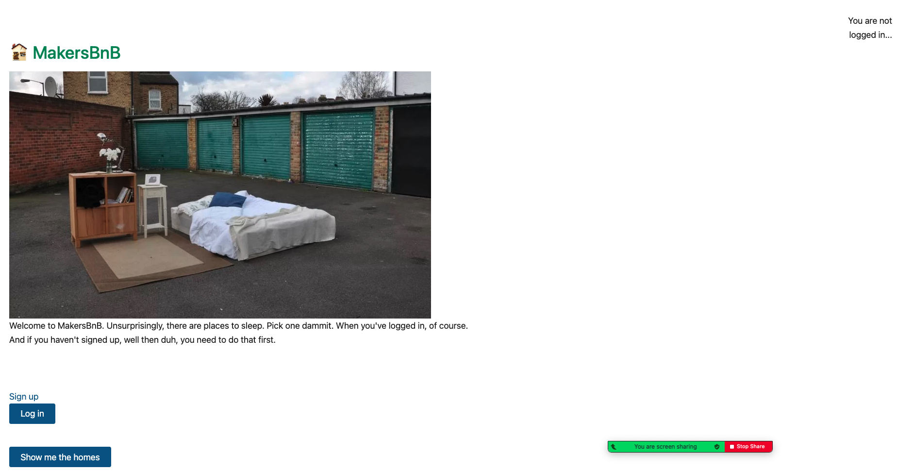
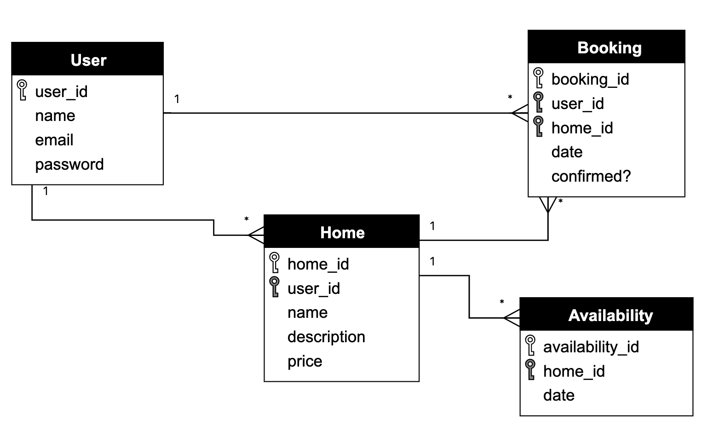
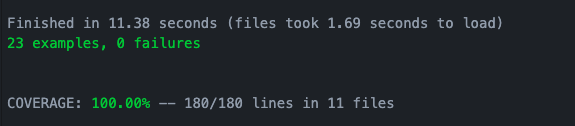

# MakersBnB

## MakersBnB specification

Design a web application that allows users to list spaces they have available, and to hire spaces for the night.



### Headline specifications

- Any signed-up user can list a new space.
- Users can list multiple spaces.
- Users should be able to name their space, provide a short description of the space, and a price per night.
- Users should be able to offer a range of dates where their space is available.
- Any signed-up user can request to hire any space for one night, and this should be approved by the user that owns that space.
- Nights for which a space has already been booked should not be available for users to book that space.
- Until a user has confirmed a booking request, that space can still be booked for that night.

```
As a user
So that I can see which homes can be booked
I want to see a list of homes

As a user
So that I can use makersbnb
I want to be able to sign-up  

As a user
So that I can make a booking associated with me
I want to be able to log in

As a user
So that I can keep my account secure
I want to be able to log out

As a user  
So that I can share my home(s)  
I want to list my home(s) on makersbnb  

As a user
So that I can best advertise my home(s)
I want to be able to give it a name, short description, price per night

As a user
So that I can specify when my home(s) is available
I want to be able to offer a range of available dates  

As a user
So that I can have a break!
I want to request to hire any home for one night

As a user
So that I can allow a booking
I want to be able to approve a request

As a user
So that my booking doesn't clash
I only want to see available dates for a specific home

As a user
So that I can gain max exposure
I want my home to remain listed until I have confirmed a booking
```

## How To Use the Program

### Cloning the repo & installing the necessary gems
```sh
$ git clone git@github.com:samanthagottleib/makersbnb.git
$ cd makersbnb
$ bundle
```

### Creating the database
1. Connect to `psql`
2. Create the database using the `psql` command `CREATE DATABASE makersbnb;`
3. Connect to the database using the `psql` command `\c makersbnb;`
4. Run the query we have saved in the file `01_create_user_table.sql`
5. Run the query we have saved in the file `02_create_home_table.sql`
6. Run the query we have saved in the file `03_create_availability_table.sql`
7. Run the query we have saved in the file `04_create_booking_table.sql`

### Setting up the test database
1. Connect to `psql`
2. Create the database using the `psql` command `CREATE DATABASE makersbnb_test;`
3. Connect to the database using the `psql` command `\c makersbnb_test;`
4. Run the query we have saved in the file `01_create_user_table.sql`
5. Run the query we have saved in the file `02_create_home_table.sql`
6. Run the query we have saved in the file `03_create_availability_table.sql`
7. Run the query we have saved in the file `04_create_booking_table.sql`

## Designing the Project

### Entity Relationship Diagram for Basic User Stories



### MVP
We decided that our MVP was for a user to be able to sign up, to add a home and to be able to see a list of available homes.

### Current State of the Project
User can sign up, and log in and out.  They have the ability to add a home, with availability, and to book one night in an available home.

### Extensions to Project
We would add the following extensions:
* Ability for home owner to approve booking
* Ability to add photos of your home
* Ability for owner to see a page of their home's bookings
* Ability for guest to see a page of their bookings
* Confirmation emails and texts
* A payment system (API)

### Test Coverage


